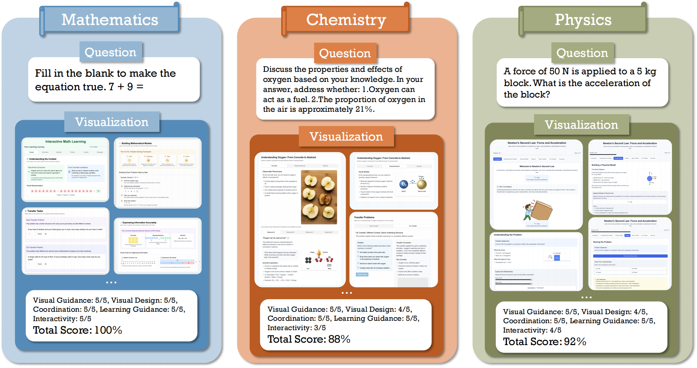

# EduVisAgent: A Multi-Agent Framework for Pedagogical Visualization

## Overview

This project implements a multi-agent system designed to generate comprehensive educational content based on user queries. It leverages a series of specialized language model (LM) agents working collaboratively to create detailed teaching plans, improve them through iterative feedback, and build structured content for various presentation formats. The core of the system is the `TeachAgentsIntermediateSystem`, which coordinates the entire workflow.



## Requirements

1. **Python 3.12**
2. **OpenAI API Key**
3. **Conda** (recommended for environment management)

## Installation

1. **Clone the repository:**
   ```bash
   git clone https://github.com/aiming-lab/EduVisAgent
   cd EduVisAgent
   ```

2. **Create and activate Conda environment:**
   ```bash
   conda create -n eduvis python=3.12
   conda activate eduvis
   ```

3. **Install dependencies:**
   ```bash
   bash install.sh
   ```

4. **Set up environment variables:**
   Create a `.env` file and add your OpenAI API key:
   ```
   OPENAI_API_KEY="your_openai_api_key_here"
   ```

## Usage

### Basic Operation

Execute the main script to run the educational content generation system:

```bash
python scripts/run_teach_intermediate.py
```

By default, this script uses predefined example queries. To modify the query, you can make changes within the script.

Output will be saved in the `outputs/teach_intermediate/` directory, with subdirectory names containing a timestamp and a brief description of the query (e.g., `outputs/teach_intermediate/YYYYMMDD_HHMMSS_explain_concept_photosynthesis/`).

### GSM8K Dataset Testing

The system also provides an example script for processing the GSM8K dataset, which can be used for batch processing of mathematical problems:

```bash
python scripts/run_gsm8k_test.py --data_file_path mydatasets/train.jsonl --num_samples 5
```

This script supports the following parameters:

- `--data_file_path`: Path to the GSM8K JSONL data file (relative to the project root), default is `mydatasets/train.jsonl`
- `--config_path`: Path to the multi-agent system configuration YAML file, default is `config/multi_agents/base.yaml`
- `--output_dir_base`: Base directory for test outputs, default is `outputs/gsm8k_tests`
- `--num_samples`: Number of samples to process (if not specified, all samples will be processed)
- `--question_field`: Field name in the JSONL file containing the question text, default is `question`

Output for each problem will be saved in a separate directory, with directory names containing a timestamp and a brief description of the problem.

## Project Features

* **Multi-Agent Collaboration:** Utilizes a series of specialized agents (such as Visual Representation Specialist, Information Expression Specialist, Cognitive Strategy Specialist, Metacognitive Strategy Specialist, Schema Instruction Specialist, Web Page Formatting Specialist) contributing diverse expertise.
* **Structured Educational Content:** Generates teaching plans broken down into logical sections, each addressing specific learning objectives.
* **Iterative Improvement:** Employs improvement cycles where expert agents provide feedback on each section of the plan, and synthesis agents integrate this feedback to improve the content.
* **Configurable Agents and Models:** Agent behaviors and LM model parameters can be configured through YAML files.
* **OpenAI Integration:** Currently uses OpenAI models (such as GPT-4o) for language generation tasks.

## Directory Structure

```
EduVisAgent/
├── agents/                         # Core agent logic
├── config/                         # Configuration files
├── models/                         # Language model interfaces
├── outputs/                        # Generated outputs
├── scripts/                        # Executable scripts
├── mydatasets/                     # Dataset files
├── image/                          # Image resources
├── webview/                        # Web viewing utilities
└── README.md                       # This file
```

